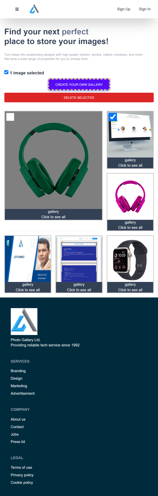

<a name="readme-top"></a>

<div align="center">
 <h3><b>Photo Gallery
</b>.
 </h3>
</div>

<div align="center">
<h3><b>Screenshot</b></h3>

</div>

<!-- TABLE OF CONTENTS -->

# 📗 Table of Contents

- [📖 About the Project](#about-project)
  - [🛠 Built With](#built-with)
    - [Tech Stack](#tech-stack)
    - [Key Features](#key-features)
  - [🚀 Live Demo](#live-demo)
- [💻 Getting Started](#getting-started)
  - [Setup](#setup)
  - [Prerequisites](#prerequisites)
  - [Install](#install)
  - [Usage](#usage)
  - [Run tests](#run-tests)
  - [Deployment](#triangular_flag_on_post-deployment)
- [👥 Authors](#authors)
- [🔭 Future Features](#future-features)
- [🤝 Contributing](#contributing)
- [⭐️ Show your support](#support)
- [🙏 Acknowledgements](#acknowledgements)
- [📝 License](#license)

<!-- PROJECT DESCRIPTION -->

## 📖 Photo Gallery <a name="about-project"></a>

Welcome to the Photo Gallery App! A fully responsive both mobile and desktop full-stack application built using React.js for the front-end and Node.js with Express.js for the back-end. It allows users to create and manage their photo galleries securely.

## 🛠 Built With <a name="built-with"></a>

## Tech Stack <a name="tech-stack"></a>

<details>
  <summary>Client</summary>
  <ul>
    <li><a href=#>It is Hosted on Netlify</a></li>
    <li>React.js</li>
    <li>Tailwind</li>
    <li>FireBase</li>
    <li>Redux</li>
    <li>React-Router-Dom</li>
  </ul>
</details>
<details>
  <summary>Server</summary>
  <ul>
    <li><a href=#>Server - It is Hosted on Render</a></li>
     <li>Node.js</li>
    <li>Express.js</li>
    <li>Mongoose</li>
    <li>JWT</li>
  </ul>
</details>

<details>
<summary>Database</summary>
  <ul>
 <li>Mongodb</li>
  </ul>
</details>

<!-- Features -->

## Key Features <a name="key-features"></a>

- User authentication with Firebase and JWT for secure access.
- CRUD (Create, Read, Update, Delete) operations for photo galleries.
- Drag-and-drop functionality for reordering images in galleries.
- Integration with Google OAuth for seamless user registration and login.
- Real-time validation of user input for registration.

<p align="right">(<a href="#readme-top">back to top</a>)</p>

<!-- LIVE DEMO -->

## 🚀 Live Demo <a name="live-demo"></a>

- [Live Demo Link](https://effulgent-basbousa-67837a.netlify.app/)

<p align="right">(<a href="#readme-top">back to top</a>)</p>

# Usage

- Sign up or log in using your Google account to access your photo galleries.
- Create new galleries and add images to them.
- Rearrange images within a gallery using drag-and-drop.
- Delete galleries or individual images.
- Enjoy seamless and secure access to your photo collections.
<!-- GETTING STARTED -->

## 💻 Getting Started <a name="getting-started"></a>

To get a local copy up and running, follow these steps.

## Prerequisites <a name="prerequisites"></a>

- In order to run this project you need:

### It would be best if you had some familiarity with `Redux`, `CSS`,`JS`, `Vite-React` and `Tailwind`.

- A Computer (MAC or PC)
- code editor (VSCode,Atom etc...)
- A browser (Chrome,Mozilla,Safari etc...)
- Version Control System (Git and Github)

# Setup <a name="setup"></a>

Clone this repository to your desired folder:

```bash
       git clone https://github.com/AbdusSattar-70/photo_gallery.git
       cd photo_gallery
```

# Install <a name="install"></a>

Install this project with:

```bash
     npm install
```

# Run tests and check errors <a name="run-tests"></a>

To run tests and check errors, run the following command:

- To check Styelint error:-

```bash
   npx stylelint "\*_/_.{css,scss}"
```

- To check Eslint error:-

```bash
  npx eslint "**/*.{js,jsx}"
```

# Deployment <a name="triangular_flag_on_post-deployment"></a>

You can deploy this project using:

- Render Hosting server or GitHub pages

```bash
   npm install
   npm run dev
```

<p align="right">(<a href="#readme-top">back to top</a>)</p>

<!-- AUTHORS -->

## 👥 Authors <a name="authors"></a>

## 👤 Abdus Sattar

- GitHub: [AbdusSattar-70](https://github.com/AbdusSattar-70)
- Twitter: [Abdus Sattar](https://twitter.com/Abdus_Sattar70)
- LinkedIn: [Abdus Sattar](https://www.linkedin.com/in/abdus-sattar-a41a26215/)

<p align="right">(<a href="#readme-top">back to top</a>)</p>

<!-- FUTURE FEATURES -->

## 🔭 Future Features <a name="future-features"></a>

- **Web Responsiveness for all users**
- **Add web accessibility**
- **Add Login page**

<p align="right">(<a href="#readme-top">back to top</a>)</p>

<!-- CONTRIBUTING -->

## 🤝 Contributing <a name="contributing"></a>

Everybody is welcome to suggest, changes,Contributions, issues, and feature request in this project.

In order to do it, fork this repository, create a new branch and open a Pull Request from your branch.

Feel free to check the [issues page](../../issues/).

<p align="right">(<a href="#readme-top">back to top</a>)</p>

<!-- SUPPORT -->

## ⭐️ Show your support <a name="support"></a>

If you like this project, Please give me ⭐️ and you can use it following [MIT](./LICENSE) license.

<p align="right">(<a href="#readme-top">back to top</a>)</p>

<!-- ACKNOWLEDGEMENTS -->

## 🙏 Acknowledgments <a name="acknowledgements"></a>

I would like to thank Firebase, React, Mongodb, Netlify and Render team for the opportunity to learn and use their platform and services free to use.

<p align="right">(<a href="#readme-top">back to top</a>)</p>

<!-- LICENSE -->

## 📝 License <a name="license"></a>

This project is under [MIT](./LICENSE) licensed.

<p align="right">(<a href="#readme-top">back to top</a>)</p>
